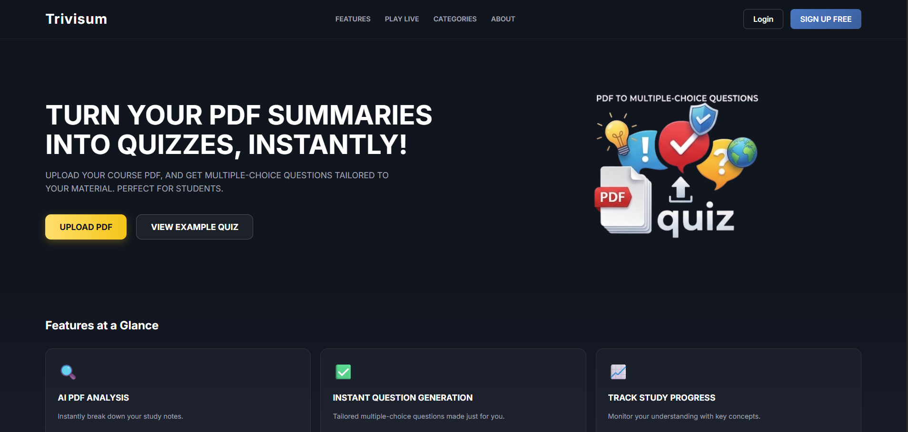
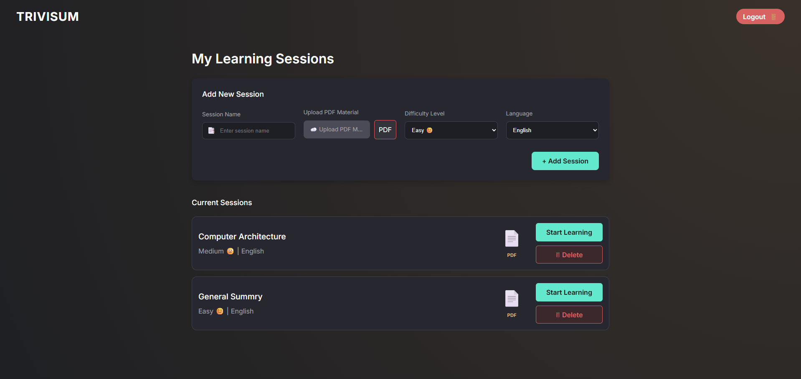
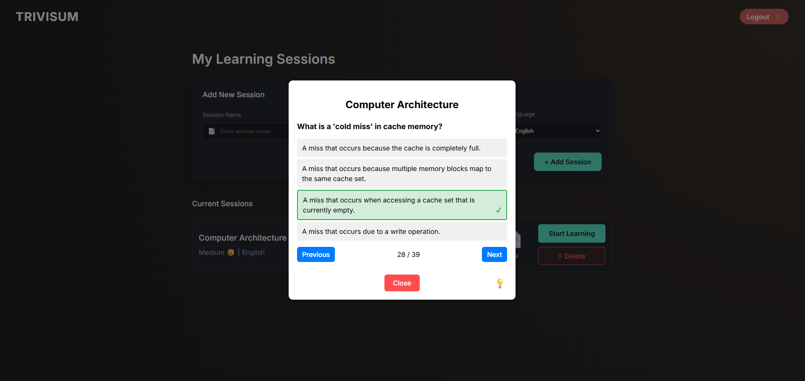
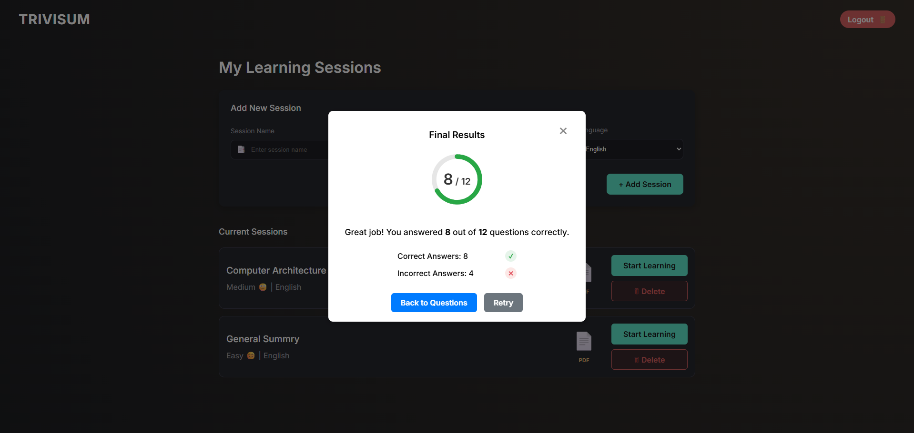

# Trivisum 🎓✨

**Trivisum** is an intelligent learning platform powered by Artificial Intelligence. It allows users to upload study materials in **PDF** format and automatically generates multiple-choice practice quizzes to help reinforce learning.

The system utilizes the **Google Gemini 2.5 Flash Lite** language model to analyze text and produce relevant questions.

---

## 🚀 Key Features

* **Clean UI:** A simple and intuitive landing page with a logo and session management.
* **PDF Upload:** Support for uploading PDF documents.
* **Text Analysis:** Client-side text extraction using `pdfjs-dist`.
* **AI Question Generator:** Integration with Google Gemini API to generate questions, options, and correct answers in JSON format.
* **Session Management:** Users can create learning sessions, saving the file and generated questions.
* **Difficulty Levels:** Support for Easy, Medium, and Hard difficulty settings to match the user's knowledge level.
* **Language Support:** Ability to generate quizzes in both English and Hebrew.
* **Interactive Results:** A dedicated results screen with score tracking and performance breakdown.

| Log In | Questions | Results |
|--------|-----------|---------|
|  |  |  |

---

## 🛠️ Tech Stack

### Frontend (`/FrontEnd`)
* **React** - UI library.
* **Vite** - Build tool and development server.
* **PDF.js** - Library for parsing PDF files in the browser.

### Backend (`/BackEnd`)
* **Node.js & Express** - Server environment and API routing.
* **Google Generative AI SDK** - Client for Gemini models.
* **CORS & Dotenv** - Security and environment variable management.

---

## ⚙️ Installation & Setup

### 1. Backend Setup
1. Navigate to the folder: `cd BackEnd`
2. Install dependencies: `npm install`
3. Create a `.env` file and add: `GEMINI_API_KEY=YOUR_KEY` (*NOTE*: you can get a free API from `Google AI Studio`, you will need a Gemini 2.5 flash lite)
4. Start the server: `node server.js` (Runs on port 5174).

### 2. Frontend Setup
1. Open a **new** terminal in the main project folder (`Trivisum`).
2. Install dependencies (since package.json is here): `npm install`
3. Run the application: `npm run dev`

---

## 📂 Project Structure

* **`BackEnd/`**: Node.js server and AI logic.
* **`FrontEnd/`**: React source code, components, and assets.

---

